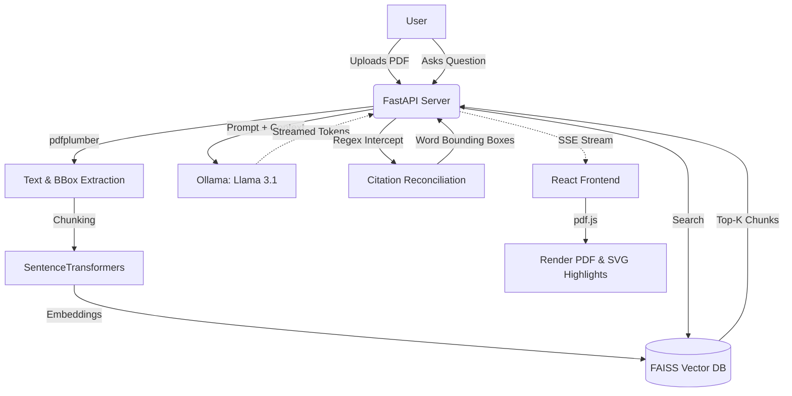

# Project 1: PDF Q&A with Highlighted Sources - Design Document

## 1. High-Level Design (HLD)

### Overview
The PDF Q&A system is a locally-hosted, privacy-first web application designed to answer user questions about a given PDF document. Instead of simply generating text, the system anchors every factual claim by highlighting the exact source passage directly on the original PDF inside the browser. 

### Core Workflows
1. **Document Ingestion**:
   - The user uploads a PDF via the frontend UI.
   - The backend extracts textual content and normalized bounding boxes for every word using `pdfplumber`.
   - The text is chunked and embedded using a local SentenceTransformer model (`all-MiniLM-L6-v2`) and stored in a FAISS vector index.
2. **Querying & Streaming**:
   - The user submits a question.
   - The backend retrieves the top-K relevant chunks from FAISS via cosine similarity.
   - The chunks are passed as context to a local LLM (`llama3.1`) running via Ollama.
   - The LLM streams its answer back via Server-Sent Events (SSE). The LLM is strictly prompted to append markdown citations in the format `[cite:id:exact quote]` for every claim.
3. **Citation & Rendering**:
   - As the backend receives the stream, a regular expression intercepts the `[cite:...]` tokens.
   - A reconciliation algorithm fuzzy-matches the quote against the original text to find the exact bounding boxes of the words.
   - The frontend `pdf.js` viewer renders the PDF to a canvas and overlays SVG rectangles at the mapped coordinates to create the "highlight" effect.

## 2. Low-Level Design (LLD)

### Components

#### Backend (`FastAPI` & `Python`)
- **`pdf_parser.py`**: Handles PDF parsing. It extracts text and spatial data (bounding boxes). The bounding boxes are normalized relative to the page dimensions (`x0/width`, `top/height`, etc.) so they remain accurate regardless of how the frontend scales the PDF canvas.
- **`embedder.py`**: Uses `sentence-transformers` to generate dense vector embeddings of text chunks and manages the `faiss-cpu` index for blazing-fast similarity search.
- **`qa_engine.py`**: The core orchestration engine. It constructs the prompt, streams the request to Ollama, and runs a state-machine parser over the incoming tokens to intercept `[cite:...]` tags. It implements `difflib.SequenceMatcher` to robustly map slightly hallucinated quotes back to exact source coordinates.
- **`main.py`**: The FastAPI entry point. It manages file uploads, serves raw PDF bytes, and exposes the `/query` SSE endpoint.

#### Frontend (`React` + `Vite`)
- **`QuestionPanel.jsx`**: Manages the chat UI. It connects to the `/query` SSE endpoint, maintaining a state array of text segments and inline citation chips. Clicking a citation chip triggers a scroll-and-flash event in the viewer.
- **`ViewerPage.jsx`**: Wraps the Mozilla `pdf.js` library. It renders the PDF pages and manages a secondary transparent SVG overlay layer where yellow citation rectangles are drawn.

## 3. System Architecture & Data Flow

## 4. Text-to-Position Mapping & Layout Edge Cases

### Mapping Mechanism
When `pdfplumber` extracts a word, it provides absolute coordinates (e.g., `x0, top, x1, bottom`). We normalize these by dividing by the page's total width and height. 
On the frontend, when `pdf.js` renders a page at a specific scale (e.g., zoomed in 150%), we simply multiply the normalized coordinates by the new canvas width and height. This guarantees pixel-perfect highlighting at any zoom level.

### Layout Edge Cases & Limitations
While the system is highly robust, certain document layouts can cause mapping or extraction failures:

1. **Multi-Column Text**: Standard PDF extractors read text in a linear, horizontal sweep. In a two-column academic paper, the extractor might read a line from the left column and immediately jump to the adjacent line in the right column, scrambling the logical sentence order. This degrades both retrieval accuracy and the LLM's ability to comprehend the context.
2. **Tables Without Borders**: Tables often rely on visual spacing rather than explicit structural tags. The extractor may crush columns together, losing the semantic relationship between headers and cells.
3. **Scanned Documents (Images)**: If a PDF is a flat image of a document (without an OCR text layer), `pdfplumber` will extract zero words. The system handles this gracefully by throwing an explicit "No selectable text found" error, but it cannot answer questions about the document.
4. **Watermarks & Headers/Footers**: Repeating headers or diagonal watermarks are extracted as regular text. If the LLM quotes a watermark, the highlight may map to every page in the document simultaneously.
5. **Ligatures & Custom Fonts**: Certain PDFs encode character pairs (like "fi" or "fl") as single custom glyphs. This can cause minor string-matching discrepancies during the fuzzy reconciliation step.
