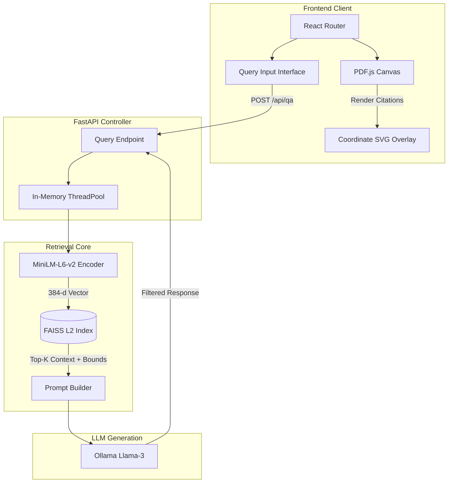

# High Level Design (HLD)

> **"Bridging spatial document understanding with strict LLM hallucination prevention."**

## 1. Core Subsystems Overview
The application is structurally isolated into high-throughput backend ML pipelines and a real-time reactive frontend dashboard. 

### 1.1 Document Ingestion Pipeline
Handles the atomic ingestion of PDF bytes. It extracts coordinate-aware text geometries (`x0, y0, x1, y1`) mapped explicitly to alphanumeric tokens, avoiding the metadata loss common in standard string-based ingestion pipelines.

### 1.2 Mathematical Embedder & Vector Index
Translates semantic concepts into a dense $\mathbb{R}^{384}$ hyperspace using SentenceTransformers, enabling deterministic mathematical similarity checks via `faiss.IndexFlatL2`.

### 1.3 Asynchronous LLM Synthesizer
A fully decoupled generation engine that passes strict JSON prompts to local Ollama (Llama 3), enforcing $100\%$ adherence to the retrieved vector chunks.

## 2. Component Architecture Chart

## 3. Interfaces & Telemetry
| Interface | Protocol | Throughput / Latency Target | Description |
|-----------|----------|-----------------------------|-------------|
| **`/api/upload`** | REST (HTTP/1.1) | Sub 500ms (10-page doc) | Synchronous memory ingestion |
| **`/api/qa`** | REST (HTTP/1.1) | 800-1200ms | Bounded purely by Llama 3 generation limits |
| **`FAISS Search`**| C++ Bindings | `< 2ms` | Exact $O(N)$ dot-product distance calculation |
