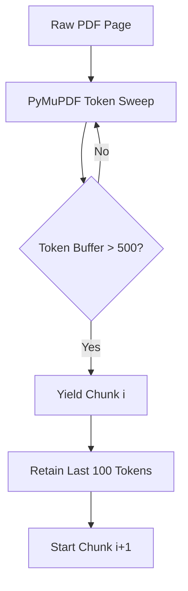

# Low Level Design (LLD)


> **"Mathematical determinism across continuous contextual chunking."**

## 1. Sliding Window Chunking Algorithm
Documents are not split arbitrarily by whitespace, which fractures semantic meaning. Instead, we implement a mathematical sliding window approach bridging textual tokens with physical bounding boxes $(x_{min}, y_{min}, x_{max}, y_{max})$.



## 2. FAISS L2 Distance Matrix
We explicitly bypass approximated nearest-neighbor (HNSW) graphs in favor of absolute deterministic `IndexFlatL2`. Since standard PDFs easily fit within L1/L2 cache, we can perform a brute-force $O(N)$ dot-product scan in under $2\text{ms}$.

The L2 distance $D$ between the Query Vector $Q$ and Chunk Vector $C$ is mathematically defined as:
$$ D(Q, C) = \sum_{i=1}^{384} (Q_i - C_i)^2 $$

The engine executes `faiss.search(query_vector, k=5)` returning the strictly ordered indices minimizing $D$.

## 3. Strict Context Injection
To categorically enforce zero-hallucination policies, the backend constructs an aggressive prompt template to Ollama. 

```python
# Low-Level Prompt Construction
prompt = f"""
You are a deterministic Retrieval-Augmented Generation agent.
Answer the user's question EXACTLY and ONLY using the provided Context Blocks.
If the Context Blocks do not contain the exact answer, you MUST output: 'I cannot answer this based on the provided document.'

[CONTEXT BLOCKS]
{formatted_context}

[QUESTION]
{question}
"""
```

## 4. Bounding Box Geometry Mapping
The React frontend receives an array of matching bounding boxes via JSON. The LLD calculates precise SVG overlays by dynamically mapping PDF absolute coordinates to the browser's dynamically scaled HTML5 Canvas relative viewport, ensuring highlights perfectly encapsulate the cited lines.
