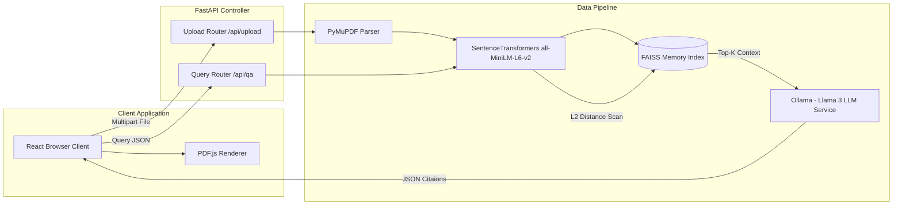

# System Architecture

## Overview
The PDF QA System operates as a low-latency RAG Microservices network. The architecture is strictly decoupled into a React/Vite visualization client and a FastAPI quantitative data pipeline.

## System Topology

## Data Flow Sequence
1. **Initialization Phase**: User triggers `POST /api/upload`. The `PyMuPDF` parser runs a coordinate-aware sweep over the document, extracting text blocks paired with strict $(x_0, y_0, x_1, y_1)$ geometric limits.
2. **Dense Packing Phase**: The sliding window chunker overlaps data, creating $N$ embedding vectors via the SentenceTransformer engine. These vectors are pushed into `faiss.IndexFlatL2`.
3. **Execution Phase**: User triggers `POST /api/qa`. The identical pipeline embeds the query string and performs a strict L2 scan.
4. **Synthesis Phase**: The backend constructs an explicit structural prompt enforcing zero-hallucination policies and sends it to the local **Ollama** engine.
5. **Visualization Phase**: The JSON containing `{"answer": "...", "boxes": [...]}` is returned to the React frontend, which parses the bounding box array and draws SVG Rectangles perfectly overlaid onto the HTML5 Canvas of the PDF.
